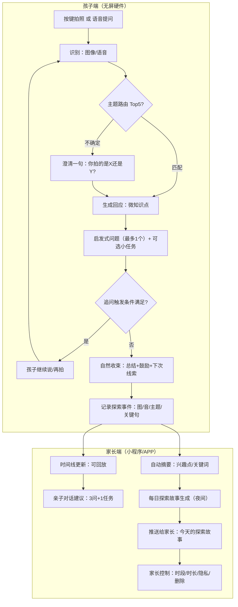

## 儿童无屏 AI 探索伙伴（3–6 岁）最终版产品方案（可用于专家评审）

### 0. 一句话概括

一款**无屏、低成本**的 AI 互动硬件，以**拍照 + 语音**为入口，用**启发式对话**把“学习”藏在“探索”里；同时用**探索记录 + 每日探索故事**帮助家长了解孩子、创造亲子话题。

---

## 1. 产品定位

* **目标用户**：3–6 岁儿童；核心购买/决策者为家长
* **产品形态**：无屏随身小硬件（拍照、麦克风、扬声器），配套家长端（小程序/APP）
* **核心定位**：

  * 对孩子：现实世界的“探索伙伴”（不是严肃学习机，不以刷题/课程为主）
  * 对家长：孩子日常的“可见窗口”（不是成绩进度表，而是了解与陪伴的抓手）

---

## 2. 价值主张（价值不靠“角色多”，而靠“探索被激发、被记录、可延续”）

### 2.1 对孩子的价值

1. **激发好奇心**：用“启发式提问 + 线下真实物体”驱动孩子自主探索（而非被动听讲）。
2. **降低表达门槛**：孩子不会完整表达也能用“拍照 + 简短语音”发起互动。
3. **轻量知识获得**：每次只给“够用、好懂、好玩”的解释，避免知识灌输。
4. **探索感与陪伴感**：首次选择一个长期“陪伴角色”，降低陌生感，让互动更愿意发生。

### 2.2 对家长的价值

1. **了解孩子在想什么**：看到孩子当天拍了什么、问了什么、AI怎么回应的。
2. **创造亲子话题**：每天自动生成一条“孩子的探索故事”，提供可直接开聊的提问建议。
3. **安心与信任**：可回放、可审视、可控（权限/时段/内容安全），让家长放心把设备交给孩子。

---

## 3. 产品基本设计

### 3.1 硬件交互（无屏）

* **输入**：一键拍照 + 语音（孩子可说“这是什么/为什么/它会怎样”）
* **输出**：语音播报（短句、拟人化、节奏慢、可重复）
* **使用姿势**：随身探索（家里/路上/公园/幼儿园回家后）

### 3.2 内容主题（Top 5：用最少覆盖最多）

| 主题      | 日常触发频次 | 常见触发方式（拍照/提问）         | 回应应讲什么（短、具体）          | 启发式引导方向（避免鹦鹉学舌）          |
| ------- | -----: | --------------------- | --------------------- | ------------------------ |
| 家庭日常物品  |     很高 | 拍：玩具/餐具/家具；问：这是什么/怎么用 | 名称+用途+1个小知识（来源/结构/安全） | “你觉得它像什么？”“你用它做过什么？”     |
| 身体与健康   |      高 | 问：为什么刷牙/洗手/睡觉；拍：牙刷/餐盘 | 原因（简单因果）+可执行的小习惯      | “你今天什么时候刷牙？”“要不要试试XX？”   |
| 天气与自然现象 |     较高 | 问：下雨/风/彩虹；拍：天空/雨滴     | 现象解释（比喻+1个事实）+观察任务    | “你看到云像什么？”“风把什么吹动了？”     |
| 动植物（常见） |     中高 | 拍：花草/小虫/鸟；问：它叫什么/做什么  | 名称（可不确定）+特征+生长/习性     | “你觉得它喜欢阳光还是阴影？”“闻到味道了吗？” |
| 社会角色与职业 |     中高 | 问：医生/消防员/老师；拍：制服/工具   | 角色做什么+为什么重要+日常连接      | “如果你是消防员会先做什么？”          |

> 设计原则：**每次交互只覆盖一个“微知识点 + 一个启发式问题 + 一个小任务”**，让孩子把注意力留在现实世界的观察上。

---

## 4. 对话设计（关键：启发式，而非机械追问）

### 4.1 教育学抓手（用于设计评审的“理论锚点”）

* **探究式学习 / Inquiry-based Learning**：从孩子的观察与提问出发，鼓励猜想、验证、再提问。
* **支架式引导 / Scaffolding**：AI 提供“刚刚好”的提示与任务，随着孩子能力调整难度。
* **开放式问题优先**：减少“重复我说的话”，增加“说出你的观察/选择/感受”。

### 4.2 “追问”不是必选，而是“条件触发”

为避免孩子鹦鹉学舌，追问只在满足条件时出现，并且追问形式以“孩子的观察”为中心：

**触发条件（满足任一即可）**

1. 孩子主动问了“为什么/怎么/还能怎样”
2. 孩子对同一对象停留/重复拍摄（兴趣信号）
3. 孩子回答了 AI 的开放式问题（有互动意愿）
4. 家长端开启“更爱追问”偏好（可配置）

**追问方式（只给一种，避免连环问）**

* “你注意到它有什么特别的地方吗？”
* “你愿意选一个：A/ B/ C 吗？”（给孩子可控选择）
* “要不要做个小实验：……？”（30 秒内可完成）

### 4.3 每轮对话的“开始与结束”

* **开始**：孩子拍照或一句话提问 → AI 复述孩子意图（确认感）→ 给出短回应
* **结束**（必须明确收束）：

  * 总结一句 + 赞赏努力（不是夸聪明）+ 给一个“下次线索”
  * 例：“你发现了它的颜色和形状，真会观察。下次我们看看它在阳光下会不会不一样。”

---

## 5. 角色系统（按你们的取向：主陪伴 + 偶尔客串）

### 5.1 角色使用方式（更贴合你们的价值主张）

* **首次使用**：孩子选择一个长期“探索伙伴”（声音与表达风格稳定，建立陪伴感）
* **减少疲劳**：不靠频繁换角色维持兴趣，而是：

  * **同角色多表达模板**（同义改写、口头禅限频、随机化句式）
  * **偶尔客串**只在“里程碑/节日/特别主题”出现一次，作为惊喜点缀

### 5.2 初步预设角色池（覆盖面优先）

* 奥特曼
* 迪士尼公主（如 Elsa）
* 皮克斯风格冒险角色（如 Buzz 类）
* 超级小飞侠
* 汪汪队

> 重要备注（供评审）：真实 IP 需要授权。MVP 可采用两条路：
> 1）**正式授权版**（商务推进后上线）
> 2）**“原创角色皮肤”替代**（先验证产品闭环与留存，再决定授权投入）

---

## 6. 家长端设计（不是“学习进度”，而是“了解与对话入口”）

### 6.1 家长可见内容

1. **探索时间线**：孩子当天的照片/语音片段（可回放）
2. **自动摘要**：今天孩子最关注的 1–3 个对象/问题
3. **每日探索故事（核心）**：

   * 以“孩子是探索者”的叙事写给家长：

     * 今天他拍了什么 → 他问了什么 → 他做了什么小观察 → 一个温柔的结尾
4. **亲子对话建议**（可直接照着问）：3 个开放式问题 + 1 个一起做的小任务

### 6.2 家长控制项（信任与安全的工程化落点）

* 开启/关闭拍照上传、语音保存
* 静音时段、每日使用时长
* 内容敏感过滤强度（保守/标准）
* 一键导出/一键删除孩子数据

---

## 7. 业务流程（含孩子端与家长端）

### 7.1 端到端流程概览（文字版）

1. **孩子触发**：拍照或语音提问
2. **识别与主题路由**：图像/语音 → 归类到 Top5 主题之一（不确定则澄清一句）
3. **生成回应**：短解释（微知识点）+ 启发式问题（最多 1 个）+ 可选小任务
4. **追问判定**：满足触发条件则进入下一轮，否则自然收束
5. **对话结束**：总结 + 鼓励 + 下次线索
6. **记录沉淀**：照片/语音/主题/关键句 → 形成“探索事件”
7. **家长端呈现**：时间线更新 + 夜间批处理生成“每日探索故事”并推送

### 7.2 业务流程图（Mermaid，可直接复制到文档/评审材料）

---

## 8. MVP 建议（先简化再优化）

**MVP 只做三件事（确保闭环）**

1. 孩子端：拍照 → 主题路由（Top5）→ 短回应 + 启发式问题 + 收束
2. 记录：探索事件沉淀（可回放）
3. 家长端：时间线 + 每日探索故事 + 亲子提问建议

**暂缓（避免过早复杂化）**

* 多角色高频客串、复杂成长体系、课程化/打卡化学习进度、过多主题扩展

---
