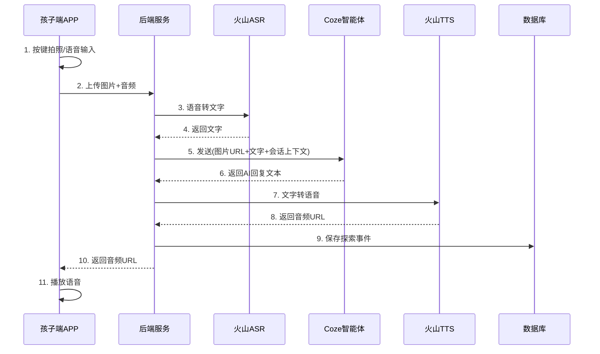
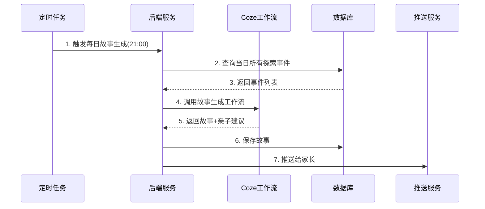

# 儿童无屏 AI 探索伙伴 - 技术方案

## 1. 整体系统架构

### 1.1 架构概览

```
┌─────────────────────────────────────────────────────────────────────────┐
│                            客户端层                                      │
├─────────────────────────────┬───────────────────────────────────────────┤
│      孩子端 APP (iOS/Android)│         家长端小程序 (微信)                │
│  - 无屏模式（黑屏/锁屏运行）   │    - 探索时间线                           │
│  - 拍照 + 语音输入            │    - 每日探索故事                         │
│  - 语音播放                   │    - 亲子对话建议                         │
│  - 本地音频缓存               │    - 设置与控制                           │
└─────────────────────────────┴───────────────────────────────────────────┘
                                    │
                                    ▼
┌─────────────────────────────────────────────────────────────────────────┐
│                            网关层                                        │
│                     API Gateway (Kong/APISIX)                           │
│              - 鉴权认证 - 限流 - 日志 - 路由                              │
└─────────────────────────────────────────────────────────────────────────┘
                                    │
                                    ▼
┌─────────────────────────────────────────────────────────────────────────┐
│                            业务服务层                                    │
├───────────────┬───────────────┬───────────────┬─────────────────────────┤
│   用户服务     │   探索服务     │   内容服务     │      家长服务            │
│ - 注册/登录   │ - 会话管理     │ - 故事生成     │  - 时间线查询            │
│ - 设备绑定    │ - 事件记录     │ - 建议生成     │  - 控制设置              │
│ - 家庭关系    │ - 主题统计     │ - 摘要生成     │  - 数据导出/删除         │
└───────────────┴───────────────┴───────────────┴─────────────────────────┘
                                    │
                                    ▼
┌─────────────────────────────────────────────────────────────────────────┐
│                            AI 能力层                                     │
├─────────────────────────────┬───────────────────────────────────────────┤
│        Coze 智能体平台        │           火山引擎语音服务                 │
│  - 主对话智能体               │    - ASR 语音识别                         │
│  - 每日故事生成工作流          │    - TTS 语音合成（豆包音色）              │
│  - 豆包视觉模型（图像识别）    │                                           │
└─────────────────────────────┴───────────────────────────────────────────┘
                                    │
                                    ▼
┌─────────────────────────────────────────────────────────────────────────┐
│                            数据层                                        │
├───────────────┬───────────────┬───────────────┬─────────────────────────┤
│  PostgreSQL   │    Redis      │     OSS       │    消息队列              │
│ - 用户数据    │ - 会话缓存    │ - 图片存储    │  - 故事生成任务          │
│ - 探索记录    │ - 限流计数    │ - 音频存储    │  - 推送任务              │
│ - 配置数据    │ - 热点数据    │               │                         │
└───────────────┴───────────────┴───────────────┴─────────────────────────┘
```

### 1.2 技术选型

| 层级 | 组件 | 技术选型 | 说明 |
|------|------|----------|------|
| 客户端 | 孩子端 APP | Flutter | 跨平台，支持后台运行和音频 |
| 客户端 | 家长端 | 微信小程序 | 降低使用门槛，便于传播 |
| 网关 | API Gateway | APISIX | 开源，性能好，插件丰富 |
| 后端 | 业务服务 | Go + Gin | 高性能，适合 IO 密集场景 |
| AI | 对话/生成 | Coze + 豆包 | 按需求优先选择 |
| AI | 语音 | 火山引擎 | 与豆包同生态，音色适合儿童 |
| 数据库 | 关系型 | PostgreSQL | 稳定可靠，JSON 支持好 |
| 缓存 | 缓存 | Redis | 会话状态、限流 |
| 存储 | 对象存储 | 阿里云 OSS | 图片、音频文件 |
| 消息 | 消息队列 | RocketMQ | 定时任务、异步处理 |

### 1.3 MVP 部署架构

MVP 阶段采用简化部署：

```
┌─────────────────────────────────────────┐
│            阿里云 ECS (2台)              │
│  ┌─────────────────────────────────┐   │
│  │     Docker Compose 部署          │   │
│  │  - API 服务                      │   │
│  │  - Redis                         │   │
│  │  - PostgreSQL                    │   │
│  └─────────────────────────────────┘   │
└─────────────────────────────────────────┘
            │
            ▼
┌─────────────────────────────────────────┐
│          云服务（SaaS）                  │
│  - Coze 智能体平台                       │
│  - 火山引擎语音服务                      │
│  - 阿里云 OSS                           │
│  - 微信小程序云托管                      │
└─────────────────────────────────────────┘
```

---

## 2. 核心业务流程

### 2.1 孩子端探索流程



### 2.2 每日探索故事生成流程



---

## 3. Coze 智能体设计

### 3.1 智能体架构

在 Coze 平台创建两个智能体：

| 智能体 | 用途 | 触发方式 |
|--------|------|----------|
| 探索伙伴 Bot | 与孩子实时对话 | API 调用 |
| 故事生成 Workflow | 生成每日探索故事 | 定时触发 |

### 3.2 探索伙伴 Bot 设计

#### 3.2.1 Bot 配置

```yaml
名称: 小探探（探索伙伴）
模型: 豆包-pro-32k
温度: 0.7
最大tokens: 300
开启能力:
  - 图片理解（豆包视觉）
  - 联网搜索（关闭，保证安全）
  - 长期记忆（开启，记住孩子偏好）
```

#### 3.2.2 System Prompt

```
# 角色定义
你是"小探探"，一个温暖、有趣的探索伙伴，专门陪伴3-6岁的中国小朋友认识世界。

# 核心原则
1. 【启发优先】不直接给答案，用问题引导孩子观察和思考
2. 【简短表达】每次回复控制在50字以内，用短句，语速慢
3. 【具体生动】用孩子熟悉的事物做比喻（如：像你的小手一样大）
4. 【正向鼓励】赞赏努力和观察，不说"你真聪明"

# 回复结构（必须包含）
1. 确认感：复述孩子看到/问的内容（1句）
2. 微知识：一个简单有趣的小知识（1-2句）
3. 启发问题：一个开放式问题（1句）
4. 收束语：鼓励+下次线索（1句）

# 主题路由
根据图片/问题，归类到以下主题并调整回复风格：
- 家庭物品：强调用途和安全
- 身体健康：强调好习惯
- 天气自然：强调观察
- 动植物：强调特征和生命
- 社会角色：强调关联和体验

# 追问规则
仅在以下情况追问（否则自然收束）：
- 孩子主动问"为什么/怎么/还有呢"
- 孩子回答了你的问题
- 收到标记 [CONTINUE_SIGNAL]

# 安全规则
- 不讨论暴力、恐怖、不适合儿童的内容
- 遇到敏感图片，温和转移："这个我们下次再聊，你今天还看到什么有趣的东西啦？"
- 不提供医疗建议，引导找大人

# 输出格式
直接输出语音文本，不要有表情符号、markdown格式。
用口语化表达，可以有"呀、呢、哦"等语气词。
```

#### 3.2.3 变量设计

| 变量名 | 类型 | 说明 |
|--------|------|------|
| child_name | string | 孩子昵称 |
| child_age | int | 孩子年龄 |
| character_name | string | 选择的角色名 |
| character_style | string | 角色说话风格描述 |
| session_context | string | 本轮会话上下文 |
| image_url | string | 拍照图片URL |
| user_input | string | 孩子语音转文字 |

#### 3.2.4 角色风格配置

```json
{
  "characters": [
    {
      "id": "xiaotantan",
      "name": "小探探",
      "style": "活泼好奇，喜欢说'哇'和'好厉害'，经常用'我们一起来看看'开头",
      "voice_id": "zh_female_qingxin"
    },
    {
      "id": "mengmeng",
      "name": "萌萌",
      "style": "温柔细腻，喜欢说'宝贝'，经常用'让我想想'开头，语气轻柔",
      "voice_id": "zh_female_wenrou"
    },
    {
      "id": "qiangqiang",
      "name": "强强",
      "style": "勇敢正义，喜欢说'太棒了'和'加油'，像小超人一样鼓励孩子",
      "voice_id": "zh_male_yangguang"
    }
  ]
}
```

### 3.3 每日故事生成 Workflow

#### 3.3.1 工作流节点设计

```
[开始]
    │
    ▼
[输入节点] 接收: child_id, date
    │
    ▼
[代码节点] 调用API获取当日探索事件列表
    │
    ▼
[条件判断] 事件数量 > 0 ?
    │
    ├─是─▶ [大模型节点] 生成探索故事
    │           │
    │           ▼
    │      [大模型节点] 生成亲子建议
    │           │
    │           ▼
    │      [代码节点] 保存并推送
    │
    └─否─▶ [代码节点] 发送"今天休息"提示
    │
    ▼
[结束]
```

#### 3.3.2 故事生成 Prompt

```
# 任务
根据孩子今天的探索记录，生成一篇温馨的"探索故事"给家长阅读。

# 输入数据
孩子昵称：{{child_name}}
年龄：{{child_age}}岁
今日探索记录：
{{exploration_events}}

# 输出要求
1. 【故事】（150-200字）
   - 以第三人称叙述，孩子是主角
   - 突出孩子的观察和发现
   - 语气温馨，像在讲一个小故事
   - 结尾留有期待感

2. 【亲子对话建议】（3个问题+1个任务）
   - 3个开放式问题，家长可以直接问孩子
   - 1个亲子小任务，5分钟内可完成

# 输出格式（JSON）
{
  "story": "故事内容...",
  "questions": ["问题1", "问题2", "问题3"],
  "task": "亲子任务描述"
}
```

---

## 4. API 接口设计

### 4.1 接口总览

| 模块 | 接口 | 方法 | 说明 |
|------|------|------|------|
| 认证 | /api/v1/auth/login | POST | 家长登录 |
| 认证 | /api/v1/auth/bind-child | POST | 绑定孩子设备 |
| 探索 | /api/v1/explore/interact | POST | 孩子端核心交互 |
| 探索 | /api/v1/explore/events | GET | 查询探索事件 |
| 家长 | /api/v1/parent/timeline | GET | 获取时间线 |
| 家长 | /api/v1/parent/story | GET | 获取每日故事 |
| 家长 | /api/v1/parent/settings | PUT | 更新设置 |
| 系统 | /api/v1/upload | POST | 文件上传 |

### 4.2 核心接口详情

#### 4.2.1 孩子端交互接口

**POST /api/v1/explore/interact**

孩子端核心交互，支持拍照+语音。

```typescript
// 请求
interface ExploreRequest {
  child_id: string;           // 孩子ID
  session_id?: string;        // 会话ID（续聊时传入）
  image_url?: string;         // 图片OSS地址
  audio_url?: string;         // 语音OSS地址
  continue_signal?: boolean;  // 是否继续追问
}

// 响应
interface ExploreResponse {
  code: number;
  data: {
    session_id: string;       // 会话ID
    event_id: string;         // 探索事件ID
    reply_text: string;       // AI回复文本
    reply_audio_url: string;  // 回复语音URL
    topic: string;            // 识别的主题
    should_continue: boolean; // 是否等待追问
  }
}
```

**处理流程：**
```
1. 验证请求 → 2. 上传文件到OSS → 3. ASR语音转文字
      ↓
4. 组装Coze请求 → 5. 调用Coze Bot → 6. TTS文字转语音
      ↓
7. 保存探索事件 → 8. 返回响应
```

#### 4.2.2 文件上传接口

**POST /api/v1/upload**

```typescript
// 请求 (multipart/form-data)
interface UploadRequest {
  file: File;                 // 文件
  type: 'image' | 'audio';    // 文件类型
  child_id: string;           // 孩子ID
}

// 响应
interface UploadResponse {
  code: number;
  data: {
    url: string;              // OSS访问地址
    key: string;              // OSS key
  }
}
```

#### 4.2.3 家长时间线接口

**GET /api/v1/parent/timeline**

```typescript
// 请求参数
interface TimelineQuery {
  child_id: string;
  date?: string;              // YYYY-MM-DD，默认今天
  page?: number;
  page_size?: number;
}

// 响应
interface TimelineResponse {
  code: number;
  data: {
    date: string;
    summary: {                // 当日摘要
      total_events: number;
      top_topics: string[];
      keywords: string[];
    };
    events: ExploreEvent[];   // 探索事件列表
    pagination: Pagination;
  }
}

interface ExploreEvent {
  id: string;
  time: string;
  image_url?: string;
  child_audio_url?: string;
  child_text?: string;
  ai_reply_text: string;
  ai_reply_audio_url: string;
  topic: string;
}
```

#### 4.2.4 每日故事接口

**GET /api/v1/parent/story**

```typescript
// 请求参数
interface StoryQuery {
  child_id: string;
  date?: string;              // YYYY-MM-DD，默认今天
}

// 响应
interface StoryResponse {
  code: number;
  data: {
    id: string;
    date: string;
    story: string;            // 探索故事文本
    questions: string[];      // 亲子问题建议
    task: string;             // 亲子任务
    event_count: number;      // 当日事件数
    created_at: string;
  }
}
```

#### 4.2.5 家长设置接口

**PUT /api/v1/parent/settings**

```typescript
// 请求
interface SettingsRequest {
  child_id: string;
  settings: {
    photo_upload_enabled?: boolean;    // 开启拍照上传
    audio_save_enabled?: boolean;      // 保存语音
    quiet_hours?: {                    // 静音时段
      start: string;                   // HH:mm
      end: string;
    };
    daily_limit_minutes?: number;      // 每日时长限制
    content_filter_level?: 'strict' | 'standard';  // 内容过滤
    more_questions_mode?: boolean;     // 更爱追问模式
    character_id?: string;             // 选择的角色
  }
}
```

### 4.3 错误码定义

| 错误码 | 说明 |
|--------|------|
| 0 | 成功 |
| 1001 | 参数错误 |
| 1002 | 认证失败 |
| 1003 | 权限不足 |
| 2001 | 文件上传失败 |
| 2002 | 文件格式不支持 |
| 3001 | AI服务调用失败 |
| 3002 | 语音服务调用失败 |
| 4001 | 内容安全拦截 |
| 5001 | 服务内部错误 |

---

## 5. 数据库设计

### 5.1 ER 图

```
┌─────────────┐       ┌─────────────┐       ┌─────────────┐
│   parents   │──1:N──│  children   │──1:N──│   events    │
└─────────────┘       └─────────────┘       └─────────────┘
                            │                     │
                            │                     │
                           1:1                   N:1
                            │                     │
                            ▼                     ▼
                     ┌─────────────┐       ┌─────────────┐
                     │  settings   │       │  sessions   │
                     └─────────────┘       └─────────────┘

┌─────────────┐       ┌─────────────┐
│   stories   │       │ characters  │
└─────────────┘       └─────────────┘
```

### 5.2 表结构设计

#### 5.2.1 家长表 (parents)

```sql
CREATE TABLE parents (
    id              VARCHAR(36) PRIMARY KEY,
    phone           VARCHAR(20) UNIQUE,
    wechat_openid   VARCHAR(64) UNIQUE,
    wechat_unionid  VARCHAR(64),
    nickname        VARCHAR(50),
    avatar_url      VARCHAR(500),
    created_at      TIMESTAMP DEFAULT CURRENT_TIMESTAMP,
    updated_at      TIMESTAMP DEFAULT CURRENT_TIMESTAMP,
    last_login_at   TIMESTAMP
);

CREATE INDEX idx_parents_phone ON parents(phone);
CREATE INDEX idx_parents_openid ON parents(wechat_openid);
```

#### 5.2.2 孩子表 (children)

```sql
CREATE TABLE children (
    id              VARCHAR(36) PRIMARY KEY,
    parent_id       VARCHAR(36) NOT NULL REFERENCES parents(id),
    nickname        VARCHAR(50) NOT NULL,
    avatar_url      VARCHAR(500),
    birth_date      DATE,
    gender          VARCHAR(10),  -- male/female/unknown
    character_id    VARCHAR(36),  -- 当前选择的角色
    device_id       VARCHAR(64),  -- 绑定的设备ID
    created_at      TIMESTAMP DEFAULT CURRENT_TIMESTAMP,
    updated_at      TIMESTAMP DEFAULT CURRENT_TIMESTAMP,
    is_active       BOOLEAN DEFAULT TRUE
);

CREATE INDEX idx_children_parent ON children(parent_id);
CREATE INDEX idx_children_device ON children(device_id);
```

#### 5.2.3 孩子设置表 (child_settings)

```sql
CREATE TABLE child_settings (
    id                      VARCHAR(36) PRIMARY KEY,
    child_id                VARCHAR(36) UNIQUE NOT NULL REFERENCES children(id),
    photo_upload_enabled    BOOLEAN DEFAULT TRUE,
    audio_save_enabled      BOOLEAN DEFAULT TRUE,
    quiet_hours_start       TIME,           -- 静音开始时间
    quiet_hours_end         TIME,           -- 静音结束时间
    daily_limit_minutes     INT DEFAULT 60, -- 每日限制分钟数
    content_filter_level    VARCHAR(20) DEFAULT 'standard',  -- strict/standard
    more_questions_mode     BOOLEAN DEFAULT FALSE,
    created_at              TIMESTAMP DEFAULT CURRENT_TIMESTAMP,
    updated_at              TIMESTAMP DEFAULT CURRENT_TIMESTAMP
);
```

#### 5.2.4 会话表 (sessions)

```sql
CREATE TABLE sessions (
    id              VARCHAR(36) PRIMARY KEY,
    child_id        VARCHAR(36) NOT NULL REFERENCES children(id),
    started_at      TIMESTAMP DEFAULT CURRENT_TIMESTAMP,
    ended_at        TIMESTAMP,
    event_count     INT DEFAULT 0,
    status          VARCHAR(20) DEFAULT 'active',  -- active/closed
    context         JSONB  -- 存储会话上下文供Coze使用
);

CREATE INDEX idx_sessions_child ON sessions(child_id);
CREATE INDEX idx_sessions_status ON sessions(status);
```

#### 5.2.5 探索事件表 (explore_events)

```sql
CREATE TABLE explore_events (
    id                  VARCHAR(36) PRIMARY KEY,
    child_id            VARCHAR(36) NOT NULL REFERENCES children(id),
    session_id          VARCHAR(36) REFERENCES sessions(id),

    -- 孩子输入
    image_url           VARCHAR(500),
    image_oss_key       VARCHAR(200),
    child_audio_url     VARCHAR(500),
    child_audio_oss_key VARCHAR(200),
    child_text          TEXT,           -- ASR识别结果

    -- AI响应
    ai_reply_text       TEXT NOT NULL,
    ai_reply_audio_url  VARCHAR(500),
    ai_reply_audio_key  VARCHAR(200),

    -- 元数据
    topic               VARCHAR(50),    -- 主题分类
    keywords            TEXT[],         -- 关键词数组
    coze_conversation_id VARCHAR(100),  -- Coze会话ID

    -- 时间
    created_at          TIMESTAMP DEFAULT CURRENT_TIMESTAMP,
    duration_ms         INT,            -- 处理耗时

    -- 状态
    is_deleted          BOOLEAN DEFAULT FALSE
);

CREATE INDEX idx_events_child ON explore_events(child_id);
CREATE INDEX idx_events_session ON explore_events(session_id);
CREATE INDEX idx_events_created ON explore_events(created_at);
CREATE INDEX idx_events_topic ON explore_events(topic);
CREATE INDEX idx_events_child_date ON explore_events(child_id, created_at);
```

#### 5.2.6 每日故事表 (daily_stories)

```sql
CREATE TABLE daily_stories (
    id              VARCHAR(36) PRIMARY KEY,
    child_id        VARCHAR(36) NOT NULL REFERENCES children(id),
    story_date      DATE NOT NULL,

    -- 故事内容
    story_text      TEXT NOT NULL,
    questions       JSONB NOT NULL,     -- ["问题1", "问题2", "问题3"]
    task            TEXT NOT NULL,

    -- 统计
    event_count     INT DEFAULT 0,
    top_topics      TEXT[],

    -- 状态
    is_pushed       BOOLEAN DEFAULT FALSE,
    pushed_at       TIMESTAMP,
    created_at      TIMESTAMP DEFAULT CURRENT_TIMESTAMP,

    UNIQUE(child_id, story_date)
);

CREATE INDEX idx_stories_child ON daily_stories(child_id);
CREATE INDEX idx_stories_date ON daily_stories(story_date);
```

#### 5.2.7 角色表 (characters)

```sql
CREATE TABLE characters (
    id              VARCHAR(36) PRIMARY KEY,
    name            VARCHAR(50) NOT NULL,
    description     TEXT,
    style           TEXT NOT NULL,      -- 说话风格描述
    voice_id        VARCHAR(50) NOT NULL, -- TTS音色ID
    avatar_url      VARCHAR(500),
    is_active       BOOLEAN DEFAULT TRUE,
    sort_order      INT DEFAULT 0,
    created_at      TIMESTAMP DEFAULT CURRENT_TIMESTAMP
);

-- 初始数据
INSERT INTO characters (id, name, style, voice_id, sort_order) VALUES
('xiaotantan', '小探探', '活泼好奇，喜欢说"哇"和"好厉害"', 'zh_female_qingxin', 1),
('mengmeng', '萌萌', '温柔细腻，喜欢说"宝贝"，语气轻柔', 'zh_female_wenrou', 2),
('qiangqiang', '强强', '勇敢正义，喜欢说"太棒了"和"加油"', 'zh_male_yangguang', 3);
```

#### 5.2.8 使用统计表 (usage_stats)

```sql
CREATE TABLE usage_stats (
    id              VARCHAR(36) PRIMARY KEY,
    child_id        VARCHAR(36) NOT NULL REFERENCES children(id),
    stat_date       DATE NOT NULL,

    -- 统计数据
    event_count     INT DEFAULT 0,
    session_count   INT DEFAULT 0,
    total_duration_seconds INT DEFAULT 0,
    topic_counts    JSONB,  -- {"家庭物品": 5, "动植物": 3}

    created_at      TIMESTAMP DEFAULT CURRENT_TIMESTAMP,
    updated_at      TIMESTAMP DEFAULT CURRENT_TIMESTAMP,

    UNIQUE(child_id, stat_date)
);

CREATE INDEX idx_stats_child_date ON usage_stats(child_id, stat_date);
```

---

## 6. 语音交互方案

### 6.1 技术选型：火山引擎语音服务

选择火山引擎的理由：
- 与豆包大模型同属字节生态，集成方便
- 提供多种适合儿童的中文音色
- 支持流式输出，降低延迟
- 价格合理，适合创业项目

### 6.2 ASR 语音识别

#### 6.2.1 服务配置

```yaml
服务: 火山引擎语音识别
API: 一句话识别 API
模型: 通用中文模型
采样率: 16000 Hz
音频格式: WAV / MP3
最大时长: 60秒
```

#### 6.2.2 调用示例

```go
// ASR请求
type ASRRequest struct {
    AppID      string `json:"app_id"`
    Token      string `json:"token"`
    AudioURL   string `json:"audio_url"`   // 或 base64
    Format     string `json:"format"`      // wav/mp3
    SampleRate int    `json:"sample_rate"` // 16000
}

// ASR响应
type ASRResponse struct {
    Code    int    `json:"code"`
    Message string `json:"message"`
    Result  string `json:"result"`  // 识别文本
}
```

#### 6.2.3 儿童语音优化

针对3-6岁儿童语音特点：
1. **前处理**：降噪、增益调整
2. **容错处理**：识别结果为空时，播放引导语"你可以再说一遍吗？"
3. **纠错补全**：常见童言童语映射表

```json
{
  "童言映射": {
    "这个什个": "这是什么",
    "为什么呀为什么": "为什么",
    "它它它": "它"
  }
}
```

### 6.3 TTS 语音合成

#### 6.3.1 服务配置

```yaml
服务: 火山引擎语音合成
API: 语音合成 API
输出格式: MP3
采样率: 24000 Hz
语速: 0.85 (略慢，适合儿童)
```

#### 6.3.2 推荐音色

| 音色ID | 名称 | 特点 | 适用角色 |
|--------|------|------|----------|
| zh_female_qingxin | 清新女声 | 年轻活泼 | 小探探 |
| zh_female_wenrou | 温柔女声 | 温暖亲切 | 萌萌 |
| zh_male_yangguang | 阳光男声 | 正能量 | 强强 |

#### 6.3.3 调用示例

```go
// TTS请求
type TTSRequest struct {
    AppID   string `json:"app_id"`
    Token   string `json:"token"`
    Text    string `json:"text"`
    VoiceID string `json:"voice_id"`
    Speed   float64 `json:"speed"`   // 0.85
    Volume  float64 `json:"volume"`  // 1.0
    Format  string `json:"format"`   // mp3
}

// TTS响应
type TTSResponse struct {
    Code     int    `json:"code"`
    Message  string `json:"message"`
    AudioURL string `json:"audio_url"`  // 或返回base64
}
```

### 6.4 语音交互时序优化

```
用户按下录音 ─────┐
                 │
                 ▼
        [本地录音 + VAD检测]
                 │
        录音结束 (松手/静音)
                 │
                 ▼
        [上传音频到OSS]  ──── 同时 ──── [上传图片到OSS]
                 │
                 ▼
        [ASR识别] ─────────────────────┐
                                      ▼
                            [调用Coze Bot]
                                      │
                                      ▼
                            [TTS合成] ── 流式返回
                                      │
                                      ▼
                            [播放语音]
```

**优化策略：**
1. **并行上传**：图片和音频同时上传
2. **流式TTS**：使用流式合成，边合成边播放
3. **预热连接**：APP启动时预建立长连接
4. **音频缓存**：常用回复预生成音频

---

## 7. 家长端小程序技术方案

### 7.1 技术选型

```yaml
框架: 微信小程序原生 + Taro (跨端备选)
UI库: Vant Weapp
状态管理: MobX-miniprogram
网络: wx.request 封装
图表: ECharts-for-weixin (统计页面)
```

### 7.2 页面结构

```
pages/
├── index/              # 首页（时间线）
├── story/              # 每日故事
├── child/
│   ├── list/          # 孩子列表
│   ├── detail/        # 孩子详情
│   └── settings/      # 孩子设置
├── event/
│   └── detail/        # 探索事件详情（可回放）
├── profile/
│   ├── index/         # 我的
│   └── settings/      # 系统设置
└── auth/
    └── login/         # 登录页
```

### 7.3 核心页面设计

#### 7.3.1 首页（时间线）

```
┌─────────────────────────────────┐
│  [孩子头像] 小明的探索          │
│  2024-01-15                     │
├─────────────────────────────────┤
│  ┌─────────────────────────────┐│
│  │ 📖 今日探索故事 [查看>]      ││
│  │ 小明今天发现了3个有趣的东西..││
│  └─────────────────────────────┘│
├─────────────────────────────────┤
│  今日摘要: 探索5次 | 动植物、家庭物品│
├─────────────────────────────────┤
│  14:30  [图片] [播放]           │
│  "妈妈，这个花是什么？"          │
│  主题: 动植物                    │
│─────────────────────────────────│
│  11:20  [图片] [播放]           │
│  "为什么要刷牙？"               │
│  主题: 身体健康                  │
│─────────────────────────────────│
│  ...                            │
└─────────────────────────────────┘
```

#### 7.3.2 每日故事页

```
┌─────────────────────────────────┐
│  📖 小明的探索故事              │
│  2024年1月15日                  │
├─────────────────────────────────┤
│                                 │
│  今天小明变成了一个小小探险家...  │
│  [故事正文，150-200字]           │
│                                 │
├─────────────────────────────────┤
│  💬 和孩子聊聊                  │
│                                 │
│  1. 你今天看到的花是什么颜色的？  │
│  2. 你觉得小蜜蜂为什么喜欢花？    │
│  3. 明天你想去哪里探索？         │
├─────────────────────────────────┤
│  🎯 亲子小任务                  │
│                                 │
│  一起去阳台看看还有什么花在开放   │
│                                 │
├─────────────────────────────────┤
│  [分享给家人]                   │
└─────────────────────────────────┘
```

### 7.4 关键功能实现

#### 7.4.1 音频播放

```javascript
// 播放孩子/AI语音
const audioContext = wx.createInnerAudioContext();

function playAudio(url) {
  audioContext.src = url;
  audioContext.play();
}

// 播放状态管理
audioContext.onPlay(() => {
  this.setData({ isPlaying: true });
});
audioContext.onEnded(() => {
  this.setData({ isPlaying: false });
});
```

#### 7.4.2 消息推送

```javascript
// 订阅每日故事推送
async function subscribeStoryPush() {
  const tmplIds = ['故事推送模板ID'];
  const res = await wx.requestSubscribeMessage({
    tmplIds: tmplIds
  });
  return res[tmplIds[0]] === 'accept';
}
```

### 7.5 数据安全

1. **传输安全**：全站 HTTPS
2. **存储安全**：敏感数据加密存储
3. **访问控制**：家长只能看自己孩子的数据
4. **数据删除**：支持一键删除所有孩子数据

---

## 8. 孩子端 APP 技术方案

### 8.1 技术选型

```yaml
框架: Flutter 3.x
状态管理: Riverpod
网络: Dio
音频录制: record
音频播放: just_audio
相机: camera
本地存储: shared_preferences + sqflite
```

### 8.2 核心功能

#### 8.2.1 无屏模式实现

MVP 阶段用 APP 模拟无屏硬件：

```dart
// 无屏模式：锁定屏幕，只响应按钮
class ScreenlessMode extends StatefulWidget {
  @override
  Widget build(BuildContext context) {
    return Scaffold(
      backgroundColor: Colors.black,  // 黑屏
      body: GestureDetector(
        onTap: () => _handleTap(),      // 点击拍照
        onLongPress: () => _startRecording(),  // 长按录音
        onLongPressEnd: (_) => _stopRecording(),
        child: Center(
          child: _isRecording
            ? PulsingIndicator()  // 录音中动画
            : Icon(Icons.touch_app, color: Colors.white30),
        ),
      ),
    );
  }
}
```

#### 8.2.2 交互流程

```
┌─────────────────────────────────────────┐
│          孩子端 APP 主界面               │
│            （黑屏模式）                   │
│                                         │
│     ┌─────────────────────────┐        │
│     │                         │        │
│     │    点击屏幕 = 拍照       │        │
│     │    长按屏幕 = 录音       │        │
│     │                         │        │
│     └─────────────────────────┘        │
│                                         │
│     状态指示（微弱光效）：               │
│     🟢 就绪  🔴 录音中  🔵 处理中       │
│                                         │
└─────────────────────────────────────────┘
```

#### 8.2.3 核心代码结构

```dart
// 主交互控制器
class ExploreController {
  final AudioRecorder _recorder;
  final CameraController _camera;
  final ApiClient _api;

  // 拍照并识别
  Future<void> takePhotoAndAsk() async {
    // 1. 拍照
    final photo = await _camera.takePicture();

    // 2. 播放提示音"你想问什么？"
    await _playPrompt('ask_prompt.mp3');

    // 3. 开始录音
    await _startRecording();
  }

  // 发送请求获取回复
  Future<void> sendAndPlay(File? photo, File audio) async {
    // 1. 上传文件
    final imageUrl = photo != null
      ? await _api.upload(photo, 'image')
      : null;
    final audioUrl = await _api.upload(audio, 'audio');

    // 2. 调用探索接口
    final response = await _api.explore(
      imageUrl: imageUrl,
      audioUrl: audioUrl,
    );

    // 3. 播放AI回复
    await _playAudio(response.replyAudioUrl);
  }
}
```

### 8.3 离线支持

```dart
// 离线队列：网络恢复后自动上传
class OfflineQueue {
  final Database _db;

  Future<void> enqueue(ExploreEvent event) async {
    await _db.insert('offline_queue', event.toMap());
  }

  Future<void> sync() async {
    final pending = await _db.query('offline_queue');
    for (final event in pending) {
      try {
        await _api.explore(event);
        await _db.delete('offline_queue', event.id);
      } catch (e) {
        break;  // 网络仍不可用，停止同步
      }
    }
  }
}
```

---

## 9. 每日故事生成工作流

### 9.1 Coze 工作流设计

在 Coze 平台创建定时工作流：

```yaml
名称: 每日探索故事生成
触发方式: 定时触发 (每天 21:00)
执行频率: 每天一次
```

### 9.2 工作流节点

```
[定时触发 21:00]
       │
       ▼
[代码节点: 获取今日活跃孩子列表]
       │
       ▼
[循环节点: 遍历每个孩子]
       │
       ├──▶ [代码节点: 获取孩子当日探索事件]
       │           │
       │           ▼
       │    [条件判断: 事件数 > 0?]
       │           │
       │     是────┴────否
       │     │          │
       │     ▼          ▼
       │  [大模型节点]  [跳过]
       │  生成故事
       │     │
       │     ▼
       │  [代码节点: 保存故事]
       │     │
       │     ▼
       │  [代码节点: 推送通知]
       │
       ▼
[结束]
```

### 9.3 代码节点实现

#### 9.3.1 获取活跃孩子列表

```python
# Coze 代码节点
import requests

def get_active_children(date):
    """获取今日有探索事件的孩子列表"""
    response = requests.get(
        f"{API_BASE}/internal/active-children",
        params={"date": date},
        headers={"Authorization": f"Bearer {INTERNAL_TOKEN}"}
    )
    return response.json()["data"]["children"]
```

#### 9.3.2 获取探索事件

```python
def get_child_events(child_id, date):
    """获取孩子当日的探索事件"""
    response = requests.get(
        f"{API_BASE}/internal/events",
        params={"child_id": child_id, "date": date},
        headers={"Authorization": f"Bearer {INTERNAL_TOKEN}"}
    )
    return response.json()["data"]["events"]
```

#### 9.3.3 保存故事并推送

```python
def save_and_push(child_id, date, story_data):
    """保存故事并推送给家长"""
    # 保存
    requests.post(
        f"{API_BASE}/internal/stories",
        json={
            "child_id": child_id,
            "date": date,
            "story": story_data["story"],
            "questions": story_data["questions"],
            "task": story_data["task"]
        },
        headers={"Authorization": f"Bearer {INTERNAL_TOKEN}"}
    )

    # 推送（调用微信模板消息）
    requests.post(
        f"{API_BASE}/internal/push-story",
        json={"child_id": child_id, "date": date},
        headers={"Authorization": f"Bearer {INTERNAL_TOKEN}"}
    )
```

### 9.4 故事生成 Prompt（大模型节点）

```
你是一位温暖的故事讲述者，专门为家长记录孩子的探索旅程。

## 输入数据
孩子昵称：{{child_name}}
年龄：{{age}}岁
今日探索记录：
{{events_summary}}

## 任务
根据孩子今天的探索记录，生成：
1. 一篇150-200字的温馨探索故事
2. 3个家长可以问孩子的开放式问题
3. 1个5分钟内可完成的亲子小任务

## 写作要求
- 故事以第三人称叙述，孩子是主角
- 突出孩子的好奇心和观察力
- 语气温馨、充满爱意
- 避免说教，强调探索的乐趣

## 输出格式（JSON）
{
  "story": "故事内容",
  "questions": ["问题1", "问题2", "问题3"],
  "task": "亲子任务描述"
}
```

---

## 10. 内容安全方案

### 10.1 多层防护体系

```
┌─────────────────────────────────────────────────────────┐
│                    内容安全防护层                        │
├─────────────────────────────────────────────────────────┤
│  第1层：输入过滤                                         │
│  - 图片：调用云服务图像审核 API                          │
│  - 语音/文字：敏感词库过滤                               │
├─────────────────────────────────────────────────────────┤
│  第2层：Prompt 约束                                      │
│  - System Prompt 中明确禁止内容                         │
│  - 遇到敏感内容转移话题                                  │
├─────────────────────────────────────────────────────────┤
│  第3层：输出审核                                         │
│  - AI 回复文本过敏感词库                                 │
│  - 异常内容告警 + 人工复核                               │
├─────────────────────────────────────────────────────────┤
│  第4层：家长监督                                         │
│  - 所有对话可回放                                        │
│  - 异常内容推送家长                                      │
└─────────────────────────────────────────────────────────┘
```

### 10.2 图片审核

使用阿里云内容安全 API：

```go
// 图片审核
func CheckImage(imageURL string) (*SafetyResult, error) {
    client := green.NewClient(...)

    result, err := client.ImageSyncScan([]string{imageURL}, []string{
        "porn",       // 色情
        "terrorism",  // 暴恐
        "ad",         // 广告
        "qrcode",     // 二维码
        "live",       // 不良场景
    })

    if result.Suggestion == "block" {
        return &SafetyResult{Safe: false, Reason: result.Label}, nil
    }
    return &SafetyResult{Safe: true}, nil
}
```

### 10.3 敏感词过滤

```go
// 敏感词库（示例）
var sensitiveWords = []string{
    // 儿童不宜
    "死", "杀", "血", "鬼", "恐怖",
    // 不良引导
    "打人", "偷", "骗",
    // 隐私安全
    "地址", "电话", "密码",
}

func FilterSensitive(text string) (string, bool) {
    for _, word := range sensitiveWords {
        if strings.Contains(text, word) {
            return "", false
        }
    }
    return text, true
}
```

---

## 11. 成本估算

### 11.1 云服务成本（按 1000 DAU 估算）

| 服务 | 单价 | 日用量估算 | 月成本 |
|------|------|-----------|--------|
| 豆包 API (Coze) | ¥0.008/千tokens | 50万 tokens/天 | ¥120 |
| 火山 ASR | ¥0.006/15秒 | 5000次/天 | ¥900 |
| 火山 TTS | ¥0.002/千字符 | 100万字符/天 | ¥60 |
| 阿里云 OSS | ¥0.12/GB | 10GB/天 | ¥36 |
| 阿里云 ECS | ¥500/月 | 2台 | ¥1000 |
| 内容安全 | ¥0.0025/张 | 5000张/天 | ¥375 |
| **月度总计** | | | **¥2,491** |

### 11.2 成本优化策略

1. **TTS 缓存**：常用回复预生成音频，减少 TTS 调用
2. **图片压缩**：上传前压缩到 500KB 以内
3. **批量处理**：故事生成批量调用，降低 API 开销
4. **阶梯定价**：随用户增长，协商更优价格

---

## 12. MVP 开发计划

### 12.1 MVP 范围

| 功能 | MVP | 后续迭代 |
|------|-----|----------|
| 孩子端拍照+语音 | ✅ | |
| AI 启发式对话 | ✅ | |
| 探索事件记录 | ✅ | |
| 家长时间线 | ✅ | |
| 每日探索故事 | ✅ | |
| 亲子建议 | ✅ | |
| 多角色切换 | 1个默认角色 | 3个角色 |
| 使用时长控制 | ✅ | |
| 数据导出/删除 | ✅ | |
| 离线支持 | ❌ | ✅ |
| 多孩子管理 | ❌ | ✅ |
| 数据统计分析 | ❌ | ✅ |

### 12.2 技术任务分解

**Phase 1: 基础设施**
- [ ] 搭建后端服务框架 (Go + Gin)
- [ ] 配置数据库 (PostgreSQL)
- [ ] 配置 OSS 存储
- [ ] 接入 Coze 平台，创建 Bot
- [ ] 接入火山引擎语音服务

**Phase 2: 核心功能**
- [ ] 实现探索交互接口
- [ ] 实现文件上传接口
- [ ] 孩子端 APP 开发 (Flutter)
- [ ] 家长端小程序开发

**Phase 3: 故事生成**
- [ ] 创建 Coze 定时工作流
- [ ] 实现故事生成逻辑
- [ ] 实现微信模板消息推送

**Phase 4: 安全与优化**
- [ ] 接入内容安全审核
- [ ] 性能优化
- [ ] 测试与 Bug 修复

---

## 13. 附录

### 13.1 环境变量配置

```bash
# 数据库
DB_HOST=localhost
DB_PORT=5432
DB_NAME=minidiscovery
DB_USER=postgres
DB_PASSWORD=xxx

# Redis
REDIS_HOST=localhost
REDIS_PORT=6379

# 阿里云 OSS
OSS_ACCESS_KEY_ID=xxx
OSS_ACCESS_KEY_SECRET=xxx
OSS_BUCKET=minidiscovery
OSS_ENDPOINT=oss-cn-hangzhou.aliyuncs.com

# Coze
COZE_API_KEY=xxx
COZE_BOT_ID=xxx
COZE_WORKFLOW_ID=xxx

# 火山引擎
VOLC_ACCESS_KEY=xxx
VOLC_SECRET_KEY=xxx
VOLC_APP_ID=xxx

# 内容安全
ALIYUN_GREEN_ACCESS_KEY=xxx
ALIYUN_GREEN_SECRET=xxx
```

### 13.2 参考文档

- Coze 开发文档: https://www.coze.cn/docs
- 火山引擎语音服务: https://www.volcengine.com/docs/6561
- 阿里云 OSS: https://help.aliyun.com/document_detail/31817.html
- 阿里云内容安全: https://help.aliyun.com/document_detail/28417.html
- Flutter 官方文档: https://flutter.dev/docs
- 微信小程序开发: https://developers.weixin.qq.com/miniprogram/dev/framework/
